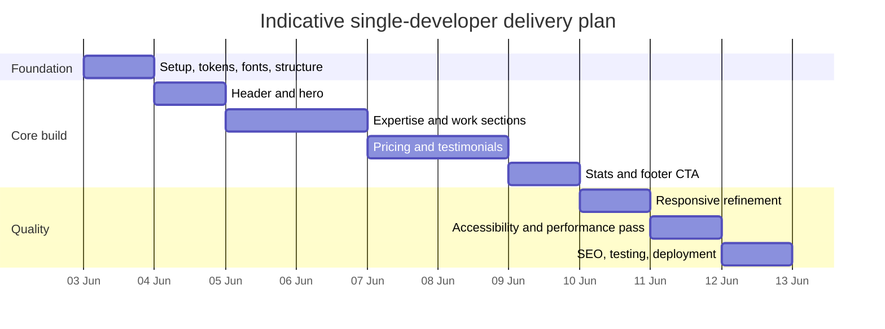

# Building a Next.js personal portfolio landing page from the Dribbble reference

## Executive summary

The supplied Dribbble reference is a dark, high-contrast, single-page personal portfolio built around a strong hero, skills visualisation, services, featured work, plan pricing, testimonials, credibility counters, and a closing call to action. The Dribbble page itself describes the concept as a personal portfolio website focused on showcasing skills, services, projects, pricing, and testimonials, and the provided screenshot additionally shows a large portrait-led hero, rate badge, stats strip, and footer-style CTA. citeturn1view0turn2view0

For a practical implementation in 2026, the strongest fit is a Next.js App Router project using mostly Server Components, with very small Client Component “islands” only where the page genuinely needs interactivity: the mobile navigation, billing toggle, and optional testimonials carousel controls. Next.js documents that layouts and pages are Server Components by default, and recommends Client Components only when you need state, event handlers, lifecycle logic, or browser APIs; it also recommends keeping the client boundary small to reduce JavaScript sent to the browser. citeturn17view0turn17view1

For styling, the most pragmatic choice for this specific page is **Tailwind CSS as the primary system**, with **small CSS Modules for bespoke decorative shapes** such as notched cards, clipped buttons, and one-off pseudo-element treatments. Current Next.js guidance explicitly recommends Tailwind CSS for most styling needs and CSS Modules for custom scoped CSS when utilities are not sufficient. By contrast, styled-components remains viable, but App Router support still requires compiler configuration plus a registry using `useServerInsertedHTML`, which is extra surface area for a page that is largely static. citeturn19view0turn15view0turn14view2turn15view2

The build should lean heavily on Next.js platform features: `next/image` for responsive media and layout stability, `next/font` for self-hosted font loading without extra network requests, the Metadata API and file conventions for SEO and social sharing, and Vercel for Git-based preview deployments and post-launch performance monitoring through Speed Insights. Those features align directly with current Next.js and Vercel best practice. citeturn14view3turn14view4turn16view0turn16view1turn16view3turn14view15turn14view16

Assuming content is local JSON/TypeScript data rather than a CMS, and assuming you recreate rather than reuse the original artwork, a polished single-developer build is realistically a **44–56 hour** job. That includes setup, section implementation, responsive refinement, accessibility, performance tuning, visual regression checks, and deployment.

## Design inventory and hierarchy

The visual language is very clear: near-black background, off-white type, orange-red accent, muted greys and warm brown/rose secondary tones, large angular display typography, soft blurred glow shapes, and cards/buttons with sharp or notched geometry. Dribbble also exposes the original palette values on the shot page: `#050404`, `#535456`, `#4F3730`, `#A1A2A3`, `#F2F3F3`, `#D8301A`, `#97817B`, and `#CEB3AB`. citeturn1view0turn2view0

### Component inventory

| Section | Content visible in the reference | Recommended implementation |
|---|---|---|
| Header | Wordmark/logo, primary nav, contact button, sticky top bar feel | Server-rendered shell, tiny Client Component only for mobile menu toggle |
| Hero | Large portrait, name/title, short intro copy, hourly rate badge, primary CTA | Two-column desktop layout, stacked on mobile, portrait as the likely LCP image |
| Skills bars | Four skill cards with labelled percentages | Map from typed data array; animate fill width only on first reveal |
| Services list | Left-hand service menu / list, right-hand project or service teaser | Desktop split layout; stack under hero on small screens |
| Recent work | Featured case-study card plus supporting card or micro-grid | Link cards to `/work/[slug]`; keep card art in local optimised media |
| Pricing | Monthly/annual toggle and three plan cards | Local state only; no global store needed |
| Testimonials | Testimonial cards in grid-like arrangement; mobile-friendly carousel is sensible | Prefer static grid on larger screens, scroll-snap carousel on mobile |
| Stats counters | Numeric credibility strip such as clients, years, awards, success rate | Mostly static markup; animated counting is optional |
| Footer CTA | Strong “Let’s work together” block, contact CTA, footer identity | Final conversion section; can include anchor/contact page/mail action |

The hierarchy below is the cleanest way to structure the page in code while keeping the interactive boundary narrow.

```mermaid
graph TD
  Page[Home Page]
  Page --> Header[Header]
  Header --> Nav[Responsive Nav]

  Page --> Hero[Hero Section]
  Hero --> HeroCopy[Name Title Copy]
  Hero --> RateBadge[Hourly Rate Badge]
  Hero --> Portrait[Large Portrait]
  Hero --> HeroCTA[Contact CTA]

  Page --> Expertise[Expertise Section]
  Expertise --> Skills[Skills Bars]
  Expertise --> Services[Services List]
  Expertise --> ServiceTeaser[Service or Project Teaser Card]

  Page --> Work[Recent Work Section]
  Work --> FeaturedProject[Featured Project Card]
  Work --> ProjectGrid[Additional Project Cards]

  Page --> Pricing[Pricing Section]
  Pricing --> BillingToggle[Monthly Annual Toggle]
  Pricing --> PlanCards[Three Pricing Cards]

  Page --> Testimonials[Testimonials Section]
  Testimonials --> TestimonialControls[Carousel Controls on Mobile]
  Testimonials --> TestimonialCards[Testimonial Cards]

  Page --> Stats[Stats Section]
  Stats --> StatCards[Counter Cards]

  Page --> FooterCTA[Footer CTA]
  FooterCTA --> ContactButton[Contact Button]
  FooterCTA --> FooterMeta[Brand Footer Info]
```



## Implementation architecture

Next.js currently recommends `create-next-app` for new projects, and the default setup already enables TypeScript, Tailwind CSS, ESLint, the App Router, Turbopack, and an import alias. The current installation guide also sets the minimum Node.js version at `20.9`. If you prefer source colocation under `src/`, Next.js supports `src/app` and recommends leaving `public` and configuration files at the project root. citeturn25search7turn20view1

### Recommended stack and project shape

Use this stack unless you already have a stronger internal convention:

- Next.js App Router
- TypeScript
- Tailwind CSS as default styling layer
- CSS Modules for 2–4 bespoke decorative classes
- Local typed content data in `src/data/site.ts`
- Motion only if you want richer entrance/layout animation
- Vercel deployment

A clean folder structure for this specific project:

```text
portfolio-site/
├─ public/
│  ├─ images/
│  │  ├─ hero-portrait.avif
│  │  ├─ hero-portrait.webp
│  │  ├─ projects/
│  │  ├─ testimonials/
│  │  └─ og/
│  └─ favicon.ico
├─ src/
│  ├─ app/
│  │  ├─ (marketing)/
│  │  │  ├─ page.tsx
│  │  │  ├─ layout.tsx
│  │  │  ├─ opengraph-image.tsx
│  │  │  ├─ twitter-image.tsx
│  │  │  ├─ sitemap.ts
│  │  │  └─ work/
│  │  │     └─ [slug]/
│  │  │        └─ page.tsx
│  │  ├─ globals.css
│  │  └─ icon.png
│  ├─ components/
│  │  ├─ layout/
│  │  │  ├─ Header.tsx
│  │  │  └─ Nav.tsx
│  │  ├─ sections/
│  │  │  ├─ Hero.tsx
│  │  │  ├─ Expertise.tsx
│  │  │  ├─ Work.tsx
│  │  │  ├─ Pricing.tsx
│  │  │  ├─ Testimonials.tsx
│  │  │  ├─ Stats.tsx
│  │  │  └─ FooterCTA.tsx
│  │  ├─ ui/
│  │  │  ├─ SectionHeading.tsx
│  │  │  ├─ SkillBar.tsx
│  │  │  ├─ PlanCard.tsx
│  │  │  ├─ ProjectCard.tsx
│  │  │  └─ TestimonialCard.tsx
│  ├─ data/
│  │  └─ site.ts
│  ├─ lib/
│  │  ├─ seo.ts
│  │  └─ utils.ts
│  └─ styles/
│     └─ notch.module.css
├─ next.config.ts
├─ postcss.config.mjs
├─ package.json
└─ tsconfig.json
```

This structure follows App Router file-system routing, route colocation, and dynamic route support for work detail pages such as `app/work/[slug]/page.tsx`. Next.js documents both the file-system approach and dynamic route segment conventions directly. citeturn14view5turn14view6turn20view0

### Routing and page composition

Use `/` for the landing page, and reserve `/work/[slug]` for deeper case studies. Use `generateStaticParams` later if you want project pages prebuilt from local data. Use `Link` for route navigation; Next.js prefetches linked routes in production when they enter the viewport. citeturn14view7turn14view8turn20view0

```tsx
// src/app/(marketing)/page.tsx
import { Hero } from '@/components/sections/Hero'
import { Expertise } from '@/components/sections/Expertise'
import { Work } from '@/components/sections/Work'
import { Pricing } from '@/components/sections/Pricing'
import { Testimonials } from '@/components/sections/Testimonials'
import { Stats } from '@/components/sections/Stats'
import { FooterCTA } from '@/components/sections/FooterCTA'

export default function HomePage() {
  return (
    <main className="bg-[var(--color-bg)] text-[var(--color-text)]">
      <Hero />
      <Expertise />
      <Work />
      <Pricing />
      <Testimonials />
      <Stats />
      <FooterCTA />
    </main>
  )
}
```

```tsx
// src/app/(marketing)/work/[slug]/page.tsx
import { notFound } from 'next/navigation'
import { projects } from '@/data/site'

type Props = {
  params: Promise<{ slug: string }>
}

export default async function WorkDetailPage({ params }: Props) {
  const { slug } = await params
  const project = projects.find((item) => item.slug === slug)

  if (!project) notFound()

  return (
    <main className="mx-auto max-w-5xl px-4 py-16 sm:px-6 lg:px-8">
      <h1 className="text-4xl font-semibold tracking-tight">{project.title}</h1>
      <p className="mt-4 max-w-2xl text-white/70">{project.summary}</p>
    </main>
  )
}
```

### Key component examples

The hero portrait is the most likely LCP element, so the page should treat it as the primary image candidate and keep the section otherwise light. Current Next.js `Image` guidance recommends preloading or eager treatment when the image is above the fold and likely to be the LCP element, while also using `sizes` for responsive layouts and static imports where possible for intrinsic dimensions and optional blur placeholders. On current docs, `priority` has been deprecated in favour of `preload` in Next.js 16, so use `preload` or `fetchPriority="high"` for new work. citeturn14view3turn27view1turn28view0turn28view2turn28view3

```tsx
// src/components/sections/Hero.tsx
import Image from 'next/image'
import Link from 'next/link'
import portrait from '@/../public/images/hero-portrait.avif'

export function Hero() {
  return (
    <section
      id="home"
      className="relative overflow-hidden px-4 pt-24 pb-16 sm:px-6 lg:px-8"
    >
      <div className="mx-auto grid max-w-7xl items-end gap-10 lg:grid-cols-[1.05fr_0.95fr]">
        <div className="order-2 lg:order-1">
          <p className="mb-6 text-xs uppercase tracking-[0.24em] text-white/60">
            Available for work
          </p>

          <h1 className="text-[clamp(3.2rem,9vw,7rem)] leading-[0.92] tracking-tight font-[var(--font-display)]">
            MADHU
          </h1>

          <div className="mt-4 flex items-center gap-3 text-sm text-white/70">
            <span className="h-px w-10 bg-white/25" />
            <span>Product Designer, Bangladesh</span>
          </div>

          <p className="mt-8 max-w-xl text-sm leading-7 text-white/65 sm:text-base">
            Product designer focused on clean, functional interfaces, strong
            visual systems, and portfolio-driven storytelling.
          </p>

          <div className="mt-8 flex flex-wrap items-center gap-4">
            <Link
              href="/#contact"
              className="inline-flex min-h-11 items-center justify-center rounded-md bg-[var(--color-accent)] px-6 text-sm font-medium text-white transition hover:translate-y-[-1px]"
            >
              Contact me
            </Link>

            <div className="rounded-xl border border-white/10 bg-white/5 px-5 py-4 backdrop-blur">
              <p className="text-3xl font-semibold tracking-tight">$75.00</p>
              <p className="mt-1 text-xs uppercase tracking-[0.18em] text-white/55">
                Hourly rate
              </p>
            </div>
          </div>
        </div>

        <div className="order-1 lg:order-2">
          <div className="relative mx-auto aspect-[4/4.3] w-full max-w-[34rem] overflow-hidden rounded-[2rem] border border-white/10 bg-white/5">
            <div
              aria-hidden="true"
              className="pointer-events-none absolute inset-x-0 bottom-0 h-40 bg-[radial-gradient(circle_at_center,rgba(216,48,26,.35),transparent_65%)]"
            />
            <Image
              src={portrait}
              alt="Studio portrait for the portfolio hero section"
              fill
              preload
              sizes="(max-width: 768px) 100vw, (max-width: 1200px) 46vw, 560px"
              className="object-contain object-bottom"
              placeholder="blur"
            />
          </div>
        </div>
      </div>
    </section>
  )
}
```

The skills section should be semantically simple: a list of labelled progress indicators, not decorative div soup. That allows screen readers to understand the values and lets sighted users scan the cards quickly.

```tsx
// src/components/ui/SkillBar.tsx
type SkillBarProps = {
  label: string
  value: number
  shortCode?: string
}

export function SkillBar({ label, value, shortCode }: SkillBarProps) {
  return (
    <li className="rounded-2xl border border-white/10 bg-white/5 p-5">
      <div className="flex items-start justify-between gap-4">
        <div>
          <p className="text-xs uppercase tracking-[0.16em] text-white/45">
            {shortCode ?? 'Skill'}
          </p>
          <h3 className="mt-2 text-sm font-medium text-white/90">{label}</h3>
        </div>
        <span className="text-3xl font-semibold tracking-tight">{value}%</span>
      </div>

      <div
        className="mt-6 h-2 rounded-full bg-white/10"
        role="progressbar"
        aria-label={label}
        aria-valuemin={0}
        aria-valuemax={100}
        aria-valuenow={value}
      >
        <div
          className="h-full rounded-full bg-[var(--color-accent)] transition-[width] duration-700"
          style={{ width: `${value}%` }}
        />
      </div>
    </li>
  )
}
```

The pricing toggle is a good example of “small client island” state. React recommends local state with `useState`, and when multiple components need the same state, lifting it to the closest common parent is the normal pattern. You do not need Context or an external store for a single billing switch. citeturn15view5turn15view4turn15view3

```tsx
// src/components/sections/Pricing.tsx
'use client'

import { useMemo, useState } from 'react'
import clsx from 'clsx'

type Billing = 'monthly' | 'annual'

const plans = [
  {
    name: 'Starter',
    monthly: 299,
    annual: 249,
    featured: false,
    features: ['4 templates unlocked', 'Unlimited requests', '1 project request', 'Email support'],
  },
  {
    name: 'Growth',
    monthly: 599,
    annual: 499,
    featured: true,
    features: ['All templates unlocked', 'Unlimited requests', 'Priority queue', 'Pause or cancel anytime'],
  },
  {
    name: 'Premium',
    monthly: 999,
    annual: 849,
    featured: false,
    features: ['Everything in Growth', 'Advanced revisions', 'Strategy call', 'Dedicated support'],
  },
] as const

export function Pricing() {
  const [billing, setBilling] = useState<Billing>('monthly')

  const periodLabel = useMemo(
    () => (billing === 'monthly' ? '/month' : '/month billed annually'),
    [billing]
  )

  return (
    <section id="pricing" className="px-4 py-20 sm:px-6 lg:px-8">
      <div className="mx-auto max-w-7xl">
        <div className="mx-auto max-w-xl text-center">
          <p className="text-xs uppercase tracking-[0.2em] text-white/50">Pricing</p>
          <h2 className="mt-4 text-4xl font-[var(--font-display)] tracking-tight">
            My pricing plan for you
          </h2>

          <div className="mt-8 inline-flex rounded-full border border-white/10 bg-white/5 p-1">
            {(['monthly', 'annual'] as const).map((value) => (
              <button
                key={value}
                type="button"
                onClick={() => setBilling(value)}
                aria-pressed={billing === value}
                className={clsx(
                  'min-h-11 rounded-full px-5 text-sm capitalize transition',
                  billing === value
                    ? 'bg-[var(--color-accent)] text-white'
                    : 'text-white/65 hover:text-white'
                )}
              >
                {value}
              </button>
            ))}
          </div>
        </div>

        <div className="mt-12 grid gap-6 lg:grid-cols-3">
          {plans.map((plan) => {
            const price = billing === 'monthly' ? plan.monthly : plan.annual
            return (
              <article
                key={plan.name}
                className={clsx(
                  'rounded-3xl border p-6',
                  plan.featured
                    ? 'border-[var(--color-accent)] bg-white/[0.06]'
                    : 'border-white/10 bg-white/[0.03]'
                )}
              >
                <p className="text-sm uppercase tracking-[0.18em] text-white/55">{plan.name}</p>
                <div className="mt-4 flex items-end gap-2">
                  <span className="text-5xl font-semibold tracking-tight">${price}</span>
                  <span className="pb-2 text-sm text-white/55">{periodLabel}</span>
                </div>

                <ul className="mt-8 space-y-3 text-sm text-white/70">
                  {plan.features.map((item) => (
                    <li key={item}>↗ {item}</li>
                  ))}
                </ul>

                <button className="mt-8 min-h-11 w-full rounded-xl bg-[var(--color-accent)] px-5 text-sm font-medium text-white">
                  Get started
                </button>
              </article>
            )
          })}
        </div>
      </div>
    </section>
  )
}
```

For testimonials, a good compromise is **grid on medium and larger screens** and a **manual scroll-snap carousel on small screens**. WAI guidance stresses semantic structure, a labelled region, and user control; if anything auto-rotates, users need the ability to stop and resume it. citeturn15view6turn15view7turn15view8

```tsx
// src/components/sections/Testimonials.tsx
'use client'

import { useRef } from 'react'

const testimonials = [
  { name: 'Alden', role: 'Product Designer', quote: 'Incredibly thoughtful process and clean execution.' },
  { name: 'Rania', role: 'Founder', quote: 'Fast, organised, and strong visual taste.' },
  { name: 'Leo', role: 'PM', quote: 'Turned a vague brief into a focused, shippable UI.' },
  { name: 'Sara', role: 'Creative Director', quote: 'A rare mix of structure, style, and speed.' },
]

export function Testimonials() {
  const listRef = useRef<HTMLUListElement>(null)

  const scrollByCard = (dir: 1 | -1) => {
    const node = listRef.current
    if (!node) return
    node.scrollBy({ left: dir * Math.round(node.clientWidth * 0.84), behavior: 'smooth' })
  }

  return (
    <section
      id="testimonials"
      aria-labelledby="testimonials-title"
      className="px-4 py-20 sm:px-6 lg:px-8"
    >
      <div className="mx-auto max-w-7xl">
        <div className="flex items-end justify-between gap-4">
          <div>
            <p className="text-xs uppercase tracking-[0.2em] text-white/50">Testimonial</p>
            <h2 id="testimonials-title" className="mt-4 text-4xl font-[var(--font-display)] tracking-tight">
              Trusted by international brand
            </h2>
          </div>

          <div className="flex gap-2 md:hidden">
            <button
              type="button"
              onClick={() => scrollByCard(-1)}
              className="min-h-11 rounded-full border border-white/10 px-4 text-sm"
              aria-label="Previous testimonial"
            >
              Prev
            </button>
            <button
              type="button"
              onClick={() => scrollByCard(1)}
              className="min-h-11 rounded-full border border-white/10 px-4 text-sm"
              aria-label="Next testimonial"
            >
              Next
            </button>
          </div>
        </div>

        <ul
          ref={listRef}
          className="mt-10 flex snap-x snap-mandatory gap-4 overflow-x-auto pb-2 md:grid md:grid-cols-2 xl:grid-cols-4 md:overflow-visible"
        >
          {testimonials.map((item) => (
            <li
              key={item.name}
              className="min-w-[84%] snap-start rounded-2xl border border-white/10 bg-white/[0.04] p-5 md:min-w-0"
            >
              <p className="text-sm leading-7 text-white/75">“{item.quote}”</p>
              <div className="mt-6">
                <p className="font-medium">{item.name}</p>
                <p className="text-sm text-white/50">{item.role}</p>
              </div>
            </li>
          ))}
        </ul>
      </div>
    </section>
  )
}
```

The responsive navigation is the other obvious client island. Use a button with `aria-expanded` and `aria-controls`, keep the desktop nav visible from `md` upward, and avoid adding router state just for hash links.

```tsx
// src/components/layout/Nav.tsx
'use client'

import { useState } from 'react'
import Link from 'next/link'
import clsx from 'clsx'

const links = [
  { href: '/#home', label: 'Home' },
  { href: '/#work', label: 'Work' },
  { href: '/#pricing', label: 'Pricing' },
  { href: '/#testimonials', label: 'Testimonials' },
  { href: '/#contact', label: 'Contact' },
]

export function Nav() {
  const [open, setOpen] = useState(false)

  return (
    <nav className="sticky top-0 z-50 border-b border-white/10 bg-black/60 backdrop-blur">
      <div className="mx-auto flex max-w-7xl items-center justify-between px-4 py-4 sm:px-6 lg:px-8">
        <Link href="/" className="text-xl font-semibold tracking-tight">
          Portilo<span className="text-[var(--color-accent)]">.</span>
        </Link>

        <ul className="hidden items-center gap-8 md:flex">
          {links.map((item) => (
            <li key={item.href}>
              <a href={item.href} className="text-sm text-white/70 transition hover:text-white">
                {item.label}
              </a>
            </li>
          ))}
        </ul>

        <a
          href="/#contact"
          className="hidden min-h-11 items-center rounded-md border border-white/10 px-4 text-sm md:inline-flex"
        >
          Contact
        </a>

        <button
          type="button"
          onClick={() => setOpen((value) => !value)}
          aria-expanded={open}
          aria-controls="mobile-menu"
          className="min-h-11 min-w-11 rounded-md border border-white/10 md:hidden"
        >
          Menu
        </button>
      </div>

      <div
        id="mobile-menu"
        className={clsx('md:hidden', open ? 'block' : 'hidden')}
      >
        <ul className="space-y-1 px-4 pb-4">
          {links.map((item) => (
            <li key={item.href}>
              <a
                href={item.href}
                onClick={() => setOpen(false)}
                className="block rounded-xl px-4 py-3 text-sm text-white/75 hover:bg-white/5 hover:text-white"
              >
                {item.label}
              </a>
            </li>
          ))}
        </ul>
      </div>
    </nav>
  )
}
```

### State management needs

This page does **not** need Redux, Zustand, Jotai, or Context as a starting point. All required interactivity is localised and can be handled with `useState` in small Client Components. If two child components must stay synchronised, lift the state to their closest shared parent; only introduce Context if you later add genuinely global UI concerns such as theme, locale, or a global contact modal. That approach follows standard React guidance and fits Next.js’ advice to minimise client bundle scope. citeturn15view5turn15view4turn17view0

## Styling, responsiveness, and assets

Next.js documents Tailwind as a utility-first framework for custom designs, and its current App Router CSS guidance explicitly says to use Tailwind for most styling needs and CSS Modules for custom scoped CSS where utilities are not sufficient. Tailwind’s mobile-first breakpoint model and theme variables also make it a strong fit for this design, which depends on consistent spacing, a controlled colour system, and a handful of carefully repeated card patterns. citeturn19view0turn14view1turn14view0

### Recommended design tokens

Use the Dribbble palette as the starting point, then convert it into semantic tokens so the code does not depend on raw colour names. Recommended mapping:

| Token | Suggested value | Use |
|---|---|---|
| `--color-bg` | `#050404` | Global background |
| `--color-surface` | `#0D0E10` | Cards and panels |
| `--color-surface-2` | `#141517` | Raised cards |
| `--color-text` | `#F2F3F3` | Primary text |
| `--color-muted` | `#A1A2A3` | Secondary text |
| `--color-accent` | `#D8301A` | Buttons, active states, fills |
| `--color-line` | `rgba(255,255,255,0.10)` | Strokes and dividers |
| `--color-glow` | `#CEB3AB` + alpha | Background glow overlays |

Those values are derived from the published palette on the Dribbble shot page. citeturn1view0

For fonts, the reference clearly uses a squared, technical display face for headings and simpler UI/body text beneath it. Because the exact face is not published, the safest approximation is to use **Chakra Petch** or **Rajdhani** for display text and **Inter** or **Manrope** for body/UI copy, loaded through `next/font/google`. Next.js’ `next/font` module self-hosts fonts and removes external font requests, which improves privacy and performance while helping avoid layout shift. citeturn14view4

A sensible spacing rhythm for faithful reproduction is an 8-point base with larger section jumps:

| Purpose | Recommended spacing |
|---|---|
| Micro spacing | 4, 8, 12 |
| Card padding | 20–28 |
| Grid gaps | 16–24 |
| Section padding | 72–120 |
| Max page width | 1200–1280 |
| Hero heading | `clamp(3rem, 8vw, 7rem)` |

### Responsive behaviour and breakpoints

Tailwind’s default breakpoints are `sm` 640px, `md` 768px, `lg` 1024px, `xl` 1280px, and `2xl` 1536px, and Tailwind also supports custom breakpoints through theme variables if you need an extra `xs` stop for this design. citeturn18view0turn18view4

Use the page like this:

| Range | Behaviour |
|---|---|
| `< 640px` | Single column; portrait stacks above copy; services list stacks above teaser card; one pricing card per row; testimonials as horizontal scroll-snap carousel; stats in 2×2 grid |
| `640–767px` | Similar to mobile but with more generous paddings and two-up skills grid |
| `768–1023px` | Hero can become asymmetric two-column; skills 2×2; projects two-up; pricing still 1–2 columns depending content width |
| `1024–1279px` | Full desktop composition; hero split; services/teaser side-by-side; pricing three-up; testimonials grid |
| `1280px+` | Widen container to ~1200–1280px and increase negative space, not component count |

For this design, the most important responsive rules are not just widths but **reordering and density**: the portrait must remain dominant without pushing the CTA too far below the fold, and pricing/testimonials must not become unreadably cramped.

### Tailwind, CSS Modules, and styled-components compared

| Approach | What the docs say | Strengths for this project | Weaknesses for this project | Recommendation |
|---|---|---|---|---|
| Tailwind CSS | Utility-first framework for custom designs; Next.js recommends it for most styling needs. citeturn19view0turn14view1 | Very fast for layout, spacing, typography, responsive rules, dark theme work, and consistency across many cards | Verbose class strings; bespoke edge shapes can be awkward | **Best primary choice** |
| CSS Modules | Built into Next.js; locally scoped class names avoid collisions. citeturn15view0turn15view1 | Excellent for one-off notch shapes, masks, pseudo-elements, and complex selectors | Slower than Tailwind for repeated layout primitives; more context switching | **Use selectively alongside Tailwind** |
| styled-components | Automatic critical CSS and unique class names, but App Router setup requires compiler config and a registry. citeturn15view2turn14view2 | Good if your team already standardises on CSS-in-JS and theme props | Extra setup, more runtime complexity, less attractive for a mostly static marketing page | **Avoid unless already a team standard** |

A small hybrid example for a bespoke notch treatment:

```css
/* src/styles/notch.module.css */
.notchCard {
  position: relative;
  overflow: hidden;
  clip-path: polygon(0 0, 100% 0, 100% 88%, 92% 100%, 0 100%);
}

.notchButton {
  clip-path: polygon(0 0, 100% 0, 94% 100%, 0 100%);
}
```

### Assets needed and how to recreate them safely

You will need:

| Asset | Source strategy |
|---|---|
| Hero portrait | Use a licensed portrait, your own photography, or an approved client asset; do not ship the original shot’s portrait without rights |
| Project thumbnails | Export from real case studies or recreate with placeholder mockups |
| Testimonial avatars | Use real client images with permission, or abstract avatars |
| Logo wordmark | Recreate as text/logo asset |
| Orange glow shapes | Prefer CSS radial gradients over raster assets |
| Icons/glyphs | Use a licensed icon set or custom SVGs |
| OG/card share image | Generate with `next/og` |

Treat the Dribbble shot as a **visual reference**, not a production asset pack. Dribbble’s terms make clear that members retain rights to their content and that copying, reproducing, or creating derivative works from Dribbble content is not generally licensed to you merely because it is visible on the platform. citeturn33search0turn33search1

Practically, the best approximation workflow is:

- sample the published palette directly from the Dribbble page;
- rebuild the layout in Figma from the screenshot using an 8-point grid;
- recreate glow blurs in CSS;
- replace all portraits and avatars with licensed equivalents;
- rebuild project thumbnails from your own work, not from the screenshot.

## Accessibility, media, performance, and SEO

Accessibility needs to be designed into the structure, not patched on later. Decorative glows, borders, and ambience images should either use CSS backgrounds or empty `alt=""`; informative portraits and project previews need meaningful alt text. WAI’s image guidance explicitly recommends null alt text for decorative images and using CSS backgrounds where possible for purely decorative visuals. citeturn21view0turn21view1

The testimonials section is where teams often create an accessibility problem. If the section behaves like a carousel on smaller screens, WAI recommends a labelled region, semantic content structure, and explicit user controls; if anything rotates automatically, users must be able to stop and resume it. For this reason, the safest implementation is **manual** next/previous controls or plain horizontal scroll-snap rather than autoplay. Text and non-text contrast should also meet WCAG thresholds, with at least **4.5:1** for normal text and **3:1** for important non-text UI affordances. citeturn15view6turn15view7turn15view8turn15view9

For motion, start with CSS transitions for hover, opacity, and small reveal effects. Web performance guidance is consistent here: prefer animating `transform` and `opacity`, and avoid properties that trigger layout or paint where possible. If you want richer motion, Motion for React can be a good fit, but only when loaded carefully. Motion’s own docs note that the full `motion` component cannot be tree-shaken below roughly 34kb, while `LazyMotion` plus the slimmer `m` component can reduce initial animation payloads to around 4.6kb before loading feature bundles. Motion also provides reduced-motion support, and WAI recommends respecting `prefers-reduced-motion` because some users experience discomfort from animated interfaces. citeturn15view14turn29search0turn29search2turn29search7turn15view10

For images, `next/image` should be used everywhere except purely decorative CSS glows. Next.js documents that `Image` provides automatic size optimisation, modern formats such as WebP, visual stability to prevent layout shift, and native lazy loading with optional blur placeholders. When using `fill` or responsive CSS sizing, add a proper `sizes` attribute so the browser can choose the right `srcset`; otherwise the browser may assume `100vw` and download unnecessarily large images. For hero imagery, use `preload` or `fetchPriority="high"` only when it is genuinely the LCP element; leave supporting images lazy. For formats, current web performance guidance recommends WebP or AVIF where possible because they generally compress better than legacy JPEG/PNG. citeturn14view3turn27view1turn28view2turn28view3turn15view11turn15view12

A practical media plan for this page:

| Asset | Preferred format | Notes |
|---|---|---|
| Hero portrait | AVIF first, WebP fallback | Keep source high quality; export 2–3 widths |
| Project thumbnails | WebP or AVIF | Balance sharpness and file size; likely `quality` around 70–80 |
| Logos/icons | SVG | Crisp and tiny |
| OG image | PNG or generated image route | Easy social sharing compatibility |
| Decorative glows | CSS gradients | Zero image bytes |

Next.js also documents static image imports as the easiest way to get intrinsic dimensions and optional blur placeholders, and remote images require you to provide dimensions plus allowed remote patterns. citeturn27view1turn22view0

Performance should be measured against Core Web Vitals: **LCP ≤ 2.5s**, **INP ≤ 200ms**, and **CLS ≤ 0.1**. That means you should keep client JavaScript limited, preload only the hero image and fonts that matter above the fold, avoid layout-shifting async content, and lazy-load any optional animation library or below-the-fold client code. Next.js’ lazy-loading guidance explicitly recommends deferring Client Components and imported libraries until they are actually needed. citeturn15view13turn14view9turn14view10

For SEO, use the Metadata API for title, description, canonical, Open Graph, and Twitter metadata; use file conventions for favicons/icons and OG images; add JSON-LD for a `Person` entity and optionally `ItemList` or `OfferCatalog`-style content for services/plans; and generate a sitemap once you add work detail routes. Next.js documents all of these pathways directly, including metadata file conventions, OG image generation, icon handling, JSON-LD rendering, and sitemap generation. citeturn16view0turn16view1turn16view2turn16view3turn32view0turn30search13

```tsx
// src/app/(marketing)/layout.tsx
import type { Metadata } from 'next'
import { Inter, Chakra_Petch } from 'next/font/google'
import '@/app/globals.css'

const inter = Inter({
  subsets: ['latin'],
  variable: '--font-body',
})

const display = Chakra_Petch({
  subsets: ['latin'],
  weight: ['400', '500', '600', '700'],
  variable: '--font-display',
})

export const metadata: Metadata = {
  title: 'Madhu — Product Designer',
  description:
    'Personal portfolio for a product designer specialising in clean interfaces, prototypes, and visual systems.',
  openGraph: {
    title: 'Madhu — Product Designer',
    description:
      'Portfolio, selected work, pricing, and testimonials.',
    images: ['/opengraph-image'],
  },
  twitter: {
    card: 'summary_large_image',
    title: 'Madhu — Product Designer',
    description:
      'Portfolio, selected work, pricing, and testimonials.',
    images: ['/twitter-image'],
  },
}

export default function MarketingLayout({
  children,
}: {
  children: React.ReactNode
}) {
  return (
    <html lang="en-GB">
      <body className={`${inter.variable} ${display.variable} bg-black text-white antialiased`}>
        {children}
      </body>
    </html>
  )
}
```

```tsx
// src/app/(marketing)/page.tsx
const personJsonLd = {
  '@context': 'https://schema.org',
  '@type': 'Person',
  name: 'Madhu',
  jobTitle: 'Product Designer',
  description:
    'Product designer specialising in interfaces, prototypes, and portfolio-driven visual systems.',
  knowsAbout: ['UI Design', 'UX Research', 'Prototyping', 'Webflow'],
}

export default function HomePage() {
  return (
    <>
      <script
        type="application/ld+json"
        dangerouslySetInnerHTML={{
          __html: JSON.stringify(personJsonLd).replace(/</g, '\\u003c'),
        }}
      />
      {/* page sections */}
    </>
  )
}
```

## Testing, deployment, and delivery plan

Next.js’ current testing guidance covers Playwright, Vitest, Jest, and Cypress. For this page, the right split is straightforward: use **Vitest + React Testing Library** for pure synchronous UI logic, use **Playwright** for route-level and responsive end-to-end checks, and use **visual comparisons** either through Playwright screenshot assertions or Storybook-based visual testing. Next.js also notes that Vitest does not currently support async Server Components well, and explicitly recommends E2E coverage for async component flows; Playwright recommends running tests against a production build to better match real behaviour. citeturn14view11turn14view12turn14view13turn26search0turn11search2

A practical testing plan for this landing page:

| Layer | Tool | What to test |
|---|---|---|
| Unit | Vitest | Pricing toggle logic, formatter helpers, data mappers |
| Component behaviour | RTL + Vitest | Nav menu buttons, keyboard handling, ARIA states |
| E2E | Playwright | Navigation, pricing toggle, anchor jumps, work detail route |
| Visual regression | Playwright screenshots or Storybook visual tests | Hero, pricing cards, testimonials, footer CTA |
| Responsive testing | Playwright projects / manual device matrix | 375, 640, 768, 1024, 1280, 1536 widths |
| Performance checks | Lighthouse locally, Vercel Speed Insights in production | LCP, INP, CLS, bundle sanity |

For deployment, Vercel is the most frictionless option. Next.js can also be deployed as a Node.js server, Docker container, static export, or via platform adapters, but Vercel has first-party integration with Git providers, preview deployment URLs for pull requests, unique generated URLs per deployment, and built-in CI/CD through Git integrations. Vercel also offers Speed Insights based on Core Web Vitals for ongoing production monitoring. citeturn25search0turn25search2turn14view14turn14view15turn31view0turn31view1turn31view2turn14view16

A sensible CI/CD setup is:

| Stage | Tooling | Trigger |
|---|---|---|
| Lint and unit tests | GitHub Actions | On pull request |
| Type-check | GitHub Actions | On pull request |
| Production-like E2E | GitHub Actions + Playwright | On pull request or pre-merge |
| Preview deployment | Vercel Git integration | Every branch push / PR |
| Production deployment | Vercel promotion or merge to main | Main branch |
| Real-user performance | Vercel Speed Insights | Post-deploy |

An example workflow file is enough:

```yaml
# .github/workflows/ci.yml
name: CI

on:
  pull_request:
  push:
    branches: [main]

jobs:
  verify:
    runs-on: ubuntu-latest
    steps:
      - uses: actions/checkout@v4
      - uses: actions/setup-node@v4
        with:
          node-version: 20
          cache: npm
      - run: npm ci
      - run: npm run lint
      - run: npm run build
      - run: npm run test
```

### Estimated timeline

The estimate below assumes one developer, content stored locally in code, no CMS, no custom backend beyond a simple contact action, and no bespoke animation-heavy storytelling.

| Task | Hours |
|---|---:|
| Project setup, fonts, Tailwind tokens, file structure | 4–6 |
| Header, navigation, hero, and portrait treatment | 6–8 |
| Skills bars, services, and recent work sections | 7–9 |
| Pricing toggle and three plan cards | 4–5 |
| Testimonials, stats, and footer CTA | 5–7 |
| Responsive refinement across breakpoints | 6–8 |
| Accessibility pass and keyboard/screen-reader fixes | 3–4 |
| Image optimisation, motion tuning, and Core Web Vitals pass | 3–4 |
| SEO metadata, OG image, JSON-LD, sitemap | 2–3 |
| Visual regression, Playwright checks, deployment | 4–6 |
| **Total** | **44–56** |



### Open questions and limitations

A few details are necessarily approximate because the Dribbble shot does not publish implementation assets or exact design specs:

| Open point | Impact |
|---|---|
| Exact fonts used in the shot are not specified | You should approve a close display/body pairing before implementation |
| The screenshot does not provide downloadable source assets | Portraits, avatars, and thumbnails should be recreated or replaced with licensed assets |
| Pricing copy and testimonial content are placeholders visually | Replace with real business copy before launch |
| The contact flow is unspecified | Decide whether CTA goes to anchor, mail action, booking link, or route-based form |
| Animation ambition is not defined | Decide early whether you want CSS-only polish or richer Motion-based transitions |

If you keep those decisions explicit and documented, this is a very straightforward App Router build: mostly static, highly optimisable, and well suited to a Tailwind-first implementation with a few carefully isolated client islands.