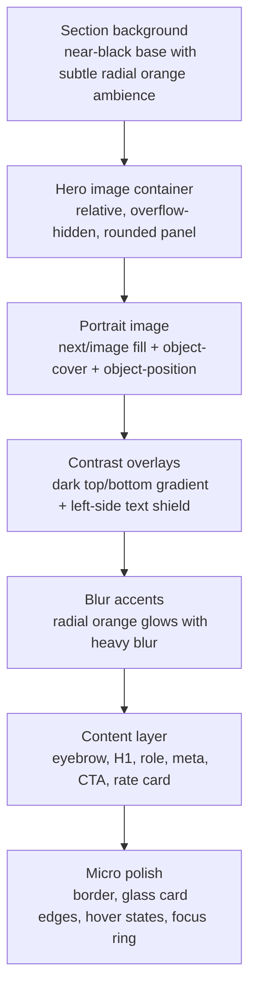
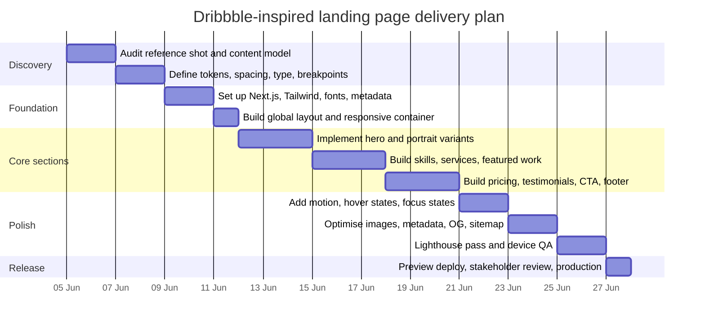

# Next.js Implementation Plan for a Dribbble-Inspired Personal Portfolio Landing Page

## Executive summary

The referenced Dribbble shot is a modern, dark, single-page personal portfolio concept built around a dominant portrait, strong display typography, orange-red accent glows, skills, services, featured work, pricing, testimonials, a CTA, and a footer. Dribbble’s own description explicitly frames it as a responsive personal-brand landing page for freelancers, designers, and developers, and exposes a palette centred on near-black, cool grey/off-white, and a vivid red-orange accent. citeturn20view0

For a production implementation, the strongest stack is **Next.js App Router + Tailwind CSS + `next/image` + `next/font`**, with **Server Components by default** and only a few thin Client Components for stateful UI such as the mobile nav drawer, billing toggle, or scroll-reveal hooks. Next.js App Router gives you clean routing, layouts, metadata, OG images, sitemap/robots support, and built-in image optimisation; Tailwind gives you rapid iteration for gradients, blur, borders, spacing, and responsive composition. citeturn21view4turn25view1turn22view0

My implementation recommendation is to build the hero as a **contained hero panel with a fill portrait inside a relatively positioned image column**, not as a full-page `body` background. That reproduces the composition of the shot more faithfully, preserves text contrast, and gives you much more predictable focal-point control with `object-fit: cover` plus `object-position`. If you want a true CSS background variant, current Next.js docs do support converting `srcSet` into `image-set()` for background images, but that should be a secondary option rather than the default for this layout. citeturn26view2turn26view1

Your uploaded HTML prototype already mirrors the same section ordering and visual density, so it can be treated as a useful structural scaffold when you migrate the design into App Router components. fileciteturn0file0

## Design translation strategy

The visual identity to preserve is not just “dark mode”, but a specific layering system: **very dark base surfaces**, **high-contrast white display text**, **subdued secondary copy**, **thin borders**, **soft glassy cards**, and **blurred orange/red radial accents** that create heat without overwhelming the content. The Dribbble palette published on the shot gives you an excellent starting token set: `#050404`, `#535456`, `#4F3730`, `#A1A2A3`, `#F2F3F3`, `#D8301A`, `#97817B`, and `#CEB3AB`. citeturn20view0

A practical starting point is:

```css
/* app/globals.css */
:root {
  --bg: #050404;
  --surface-0: #0a0a0a;
  --surface-1: #111111;
  --surface-2: #171717;
  --text-1: #f2f3f3;
  --text-2: #a1a2a3;
  --text-3: #7f8285;
  --accent-500: #d8301a;
  --accent-400: #ce5e4d;
  --accent-brown: #4f3730;
  --line: rgba(255, 255, 255, 0.1);
  --card: rgba(255, 255, 255, 0.04);

  --radius-xl: 1.75rem;
  --radius-2xl: 2.25rem;

  --max-content: 80rem;   /* 1280px */
  --section-y: clamp(4rem, 7vw, 8rem);
}

/* Tailwind 4 mapping; if you stay on Tailwind 3, extend theme in tailwind.config instead */
@theme {
  --color-bg: var(--bg);
  --color-surface: var(--surface-1);
  --color-accent: var(--accent-500);
  --breakpoint-xs: 30rem;   /* 480px */
  --breakpoint-3xl: 120rem; /* 1920px */
}
```

Those values are intentionally close to the published shot palette, while still giving you enough separation between background, surface, and stroke layers. Tailwind’s current docs support CSS-first theme variables for both colours and breakpoints, and its default breakpoint system is mobile-first: `sm` 640px, `md` 768px, `lg` 1024px, `xl` 1280px, `2xl` 1536px. citeturn8view6turn8view7turn27view0turn27view3

For fonts, the exact typeface in the shot is not published. A sensible implementation pair is a **clean text face** such as **Geist** or **Inter** for body copy, paired with a **square, techno-leaning display face** such as **Oxanium** or **Orbitron** for the H1/H2s. The key is less the exact font and more the contrast between a neutral body face and a strong geometric display face. If you use Google fonts, serve them through `next/font` rather than hot-linking them, so they are downloaded at build time and self-hosted with the rest of your static files. citeturn14view3

### Portrait strategy comparison

| Approach | Advantages | Trade-offs | Implementation notes |
|---|---|---|---|
| Full-bleed portrait inside hero panel | Closest to the reference; dramatic LCP element; lets blur/glow layers sit behind and over the image cleanly | Can reduce text contrast if the face or highlights sit directly behind copy; cropping becomes critical on narrow screens | Use `Image fill`, a relative parent, `object-cover`, and a precise `sizes` string. Tune `object-position` per breakpoint. If the image is the hero/LCP element, preload it. citeturn24view1turn26view2turn24view0 |
| Boxed portrait card | Safer contrast; easier to preserve the face crop; visually cleaner on tablet/mobile | Slightly less “editorial” than the shot; can feel detached if the card is too small | Use a fixed aspect ratio such as `aspect-[4/5]`, an overlay gradient, and one concise identity block at the bottom. Width/height or `fill` both work here. citeturn24view1turn26view2 |
| True CSS background image | Useful only if the portrait is purely atmospheric and not semantic content | Weaker accessibility semantics; trickier to control responsive art direction; harder to reason about LCP | If you must do it, use `getImageProps()` and convert generated `srcSet` to CSS `image-set()`. This is an advanced variant, not the default recommendation. citeturn26view1 |

In practice, I would use **full-bleed portrait within a contained hero panel** on desktop, and switch to a **boxed portrait card** or a shorter portrait frame on tablet/mobile if the face crop starts fighting the copy.

### Layer-order mock



The important implementation detail is that the **portrait itself should be on its own layer**, and **contrast gradients should sit above it but below the content**. Orange glows work best as separate absolutely positioned layers rather than as part of the image, which keeps the design editable and reusable. Tailwind’s gradient and blur utilities support this pattern directly. citeturn9view1turn8view4turn7view1

## Architecture and component model

App Router’s file conventions are well-suited to this project. Next.js now explicitly recommends route groups for organisation without changing the URL, private folders for non-routable implementation details, and optional `src/` placement for application code. Only `page` and `route` files create routable output; colocated support files are safe. citeturn21view0turn21view1turn21view2turn21view3

### Component breakdown

| Component | Responsibility | Core props | State | Server or client |
|---|---|---|---|---|
| `RootLayout` | Global shell, metadata, font classes, body theme | `children` | None | Server |
| `LandingPage` | Composes all sections in order | Optional page data object | None | Server |
| `Header` | Brand mark, nav links, CTA button | `links`, `ctaLabel`, `ctaHref` | `isOpen` for mobile menu | Client |
| `Hero` | H1, role, meta, CTA, portrait, rate badge | `name`, `role`, `location`, `rate`, `portraitSrc`, `portraitAlt`, `portraitPosition` | None unless you add a reveal hook | Server by default |
| `SkillBars` | Displays skill list and percentages | `items: {label; value; hint?}[]` | None | Server |
| `ServicesList` | Flat list or stacked category rail | `items: string[]`, `activeLabel?` | Optional `activeLabel` only if interactive | Server or Client |
| `FeaturedProject` | One strong visual card and short summary | `title`, `summary`, `image`, `tags`, `href` | None | Server |
| `Pricing` | Three cards, optional billing toggle | `plans`, `defaultCycle` | `billingCycle` | Client |
| `Testimonials` | Static grid on desktop, swipe/carousel on mobile | `items` | Optional `activeIndex` on mobile | Client only if carousel |
| `StatsStrip` | Short KPI row | `items` | None | Server |
| `CTASection` | Final conversion block | `headline`, `button`, `supportCopy` | None | Server |
| `Footer` | Contact, back-to-top, copyright | `links`, `contact`, `copyright` | None | Server |
| `WebVitals` | Sends CWV metrics to analytics | none | None | Client |

The key architectural rule is simple: **keep almost everything as Server Components** and introduce Client Components only where real state exists. That keeps the JavaScript budget lower and improves interaction performance. Next’s `useReportWebVitals` pattern is especially clean because you can isolate the client boundary to a single tiny component imported by `layout.tsx`. citeturn18view0

### Suggested file structure

```text
src/
  app/
    (marketing)/
      layout.tsx
      page.tsx
      opengraph-image.jpg
      twitter-image.jpg
      _components/
        Header.tsx
        Hero.tsx
        HeroPortraitCard.tsx
        SkillBars.tsx
        ServicesList.tsx
        FeaturedProject.tsx
        Pricing.tsx
        Testimonials.tsx
        StatsStrip.tsx
        CTASection.tsx
        Footer.tsx
    globals.css
    robots.ts
    sitemap.ts

  content/
    landing.ts

  lib/
    design-tokens.ts
    seo.ts
    web-vitals.ts
    utils.ts

  public/
    images/
      portraits/
        madhu-hero.jpg
      projects/
        featured-app.webp
      testimonials/
        client-01.jpg
        client-02.jpg

  types/
    landing.ts

next.config.ts
postcss.config.mjs
package.json
tsconfig.json
eslint.config.mjs
```

This layout uses a route group for the marketing page, a private `_components` folder for segment-local UI, and top-level metadata files such as `robots.ts`, `sitemap.ts`, and route-specific OG assets. That aligns closely with the current Next.js project-structure and metadata conventions. citeturn21view1turn21view4turn25view1turn25view4

If you prefer **CSS Modules** instead of Tailwind, keep the same component tree and place files such as `Hero.module.css`, `Pricing.module.css`, and `Testimonials.module.css` beside the matching components. Next.js documents CSS Modules as locally scoped `.module.css` files and explicitly recommends them when utility classes are not sufficient. citeturn23view0turn23view1

## Core implementation patterns

The current Next.js `Image` component supports `fill`, `sizes`, `placeholder`, `blurDataURL`, `preload`, `loading`, `style`, and remote image configuration. Static imports of `jpg`, `png`, `webp`, and `avif` automatically receive a `blurDataURL`, which is exactly what you want for the hero portrait if you store it locally in `public/` or import it from the file system. citeturn24view0turn24view1

### Hero with fill portrait, object-position, blur placeholder, and overlays

```tsx
// src/app/(marketing)/_components/Hero.tsx
import Image from 'next/image'
import portrait from '@/public/images/portraits/madhu-hero.jpg'

type HeroProps = {
  name: string
  role: string
  location: string
  rate: string
  portraitAlt?: string
  portraitPosition?: string
}

export function Hero({
  name,
  role,
  location,
  rate,
  portraitAlt = 'Portrait of Madhu Miah',
  portraitPosition = '72% 18%',
}: HeroProps) {
  return (
    <section className="relative overflow-hidden rounded-[2rem] border border-white/10 bg-[var(--surface-0)]">
      <div className="mx-auto grid min-h-[680px] max-w-[var(--max-content)] items-end gap-8 px-5 py-6 sm:px-8 sm:py-8 lg:grid-cols-[minmax(0,1fr)_minmax(360px,520px)] lg:px-10 lg:py-10">
        <div className="relative z-20 max-w-2xl self-start pt-4 lg:pt-8">
          <p className="mb-4 text-xs uppercase tracking-[0.28em] text-[var(--text-2)]">
            Available for work
          </p>

          <h1 className="max-w-[12ch] font-display text-5xl leading-[0.92] sm:text-7xl lg:text-[5.5rem]">
            {name}
          </h1>

          <p className="mt-4 text-base text-[var(--text-2)] sm:text-lg">
            {role}, {location}
          </p>

          <p className="mt-6 max-w-[48ch] text-sm leading-7 text-[var(--text-2)] sm:text-base">
            Clean interfaces, fast frontends, strong product thinking, and a
            premium portfolio presence built to convert.
          </p>

          <div className="mt-8 flex flex-wrap gap-3">
            <a
              href="#contact"
              className="rounded-full bg-[var(--accent-500)] px-6 py-3 text-sm font-semibold text-white transition hover:-translate-y-0.5"
            >
              Hire me
            </a>
            <a
              href="#projects"
              className="rounded-full border border-white/15 px-6 py-3 text-sm font-semibold text-white/90 transition hover:border-white/30 hover:bg-white/5"
            >
              Recent work
            </a>
          </div>
        </div>

        <div className="relative min-h-[420px] overflow-hidden rounded-[1.75rem] border border-white/8 bg-black/30 sm:min-h-[540px] lg:min-h-[640px]">
          <Image
            src={portrait}
            alt={portraitAlt}
            fill
            priority
            placeholder="blur"
            sizes="(max-width: 767px) 100vw, (max-width: 1279px) 52vw, 520px"
            className="object-cover"
            style={{ objectPosition: portraitPosition }}
          />

          {/* contrast + ambience layers */}
          <div className="absolute inset-0 bg-linear-to-b from-black/5 via-black/20 to-black/75" />
          <div className="absolute inset-y-0 left-0 w-2/3 bg-linear-to-r from-[rgb(5_4_4_/_0.92)] via-[rgb(5_4_4_/_0.55)] to-transparent" />
          <div className="pointer-events-none absolute -left-16 top-10 size-56 rounded-full bg-[radial-gradient(circle,rgba(216,48,26,0.28),transparent_68%)] blur-3xl" />
          <div className="pointer-events-none absolute -right-8 bottom-[-2rem] size-72 rounded-full bg-[radial-gradient(circle,rgba(216,48,26,0.22),transparent_70%)] blur-3xl" />

          <div className="absolute bottom-4 right-4 z-20 rounded-2xl border border-white/10 bg-black/35 px-4 py-3 backdrop-blur-xl">
            <div className="text-2xl font-semibold text-white">{rate}</div>
            <div className="text-xs uppercase tracking-[0.2em] text-[var(--text-2)]">
              Hourly rate
            </div>
          </div>
        </div>
      </div>
    </section>
  )
}
```

This pattern is grounded in the recommended Next.js image workflow: `fill` requires a positioned parent; `sizes` should be set when using `fill`; local static imports can auto-generate the blur placeholder data; and hero/LCP images are the main case where explicit preloading is appropriate. Because you specifically requested a `priority` example, the snippet includes it, but note that **current Next.js 16 deprecates `priority` in favour of `preload`**. If you start on the latest docs, replace `priority` with `preload`. citeturn24view1turn26view2

For **portrait cropping**, start around `object-position: 72% 18%` on desktop if the face sits slightly right of centre, then test narrower viewports and adjust to values closer to `60% 14%` or `center top`. The best approach is to keep the **eyes in the upper third** of the safe frame and avoid letting the CTA row overlap the brightest facial highlights.

### Overlay-only snippet

```tsx
{/* image */}
<Image
  src={portrait}
  alt="Portrait of Madhu Miah"
  fill
  placeholder="blur"
  sizes="(max-width: 767px) 100vw, 50vw"
  className="object-cover"
/>

{/* dark readability mask */}
<div className="absolute inset-0 bg-linear-to-b from-black/0 via-black/15 to-black/75" />

{/* left-side shield so H1 never sits on skin tones */}
<div className="absolute inset-y-0 left-0 w-[58%] bg-linear-to-r from-[rgb(5_4_4_/_0.96)] via-[rgb(5_4_4_/_0.58)] to-transparent" />

{/* orange glow accents */}
<div className="absolute -left-20 top-8 size-60 rounded-full bg-[radial-gradient(circle,rgba(216,48,26,0.24),transparent_70%)] blur-3xl" />
<div className="absolute right-0 bottom-0 size-72 rounded-full bg-[radial-gradient(circle,rgba(216,48,26,0.16),transparent_70%)] blur-3xl" />
```

Tailwind’s current docs support radial gradients, linear gradients, custom colour stops, and backdrop blur utilities, so this styling can stay almost entirely in markup if you prefer. citeturn9view0turn9view1turn7view1

### Fallback boxed portrait variant

```tsx
// src/app/(marketing)/_components/HeroPortraitCard.tsx
import Image, { StaticImageData } from 'next/image'

type HeroPortraitCardProps = {
  src: StaticImageData
  alt: string
  name: string
  role: string
}

export function HeroPortraitCard({
  src,
  alt,
  name,
  role,
}: HeroPortraitCardProps) {
  return (
    <div className="relative mx-auto aspect-[4/5] max-w-[26rem] overflow-hidden rounded-[1.75rem] border border-white/10 bg-white/[0.03] shadow-[0_24px_80px_rgba(0,0,0,0.45)] backdrop-blur-xl">
      <Image
        src={src}
        alt={alt}
        fill
        preload
        placeholder="blur"
        sizes="(max-width: 767px) 86vw, 420px"
        className="object-cover"
        style={{ objectPosition: 'center top' }}
      />

      <div className="absolute inset-0 bg-linear-to-t from-black/75 via-black/10 to-black/5" />
      <div className="absolute inset-x-0 bottom-0 p-5">
        <div className="text-2xl font-semibold text-white">{name}</div>
        <div className="mt-1 text-sm text-[var(--text-2)]">{role}</div>
      </div>
    </div>
  )
}
```

Use this version when the source portrait is weaker, when the face must remain completely intact, or when tablet/mobile crops become too aggressive. The semantic guidance for `alt` still applies: if the image communicates identity, give it a real alt such as “Portrait of Madhu Miah”; if it is purely decorative and adjacent text already fully conveys the same information, empty alt text is acceptable. citeturn24view1turn12view4

### Blur, gradient, glass, and skill-bar utilities

```css
/* app/globals.css */
@import "tailwindcss";

html {
  color-scheme: dark;
}

body {
  background:
    radial-gradient(circle at 14% 10%, rgba(216, 48, 26, 0.12), transparent 20rem),
    radial-gradient(circle at 86% 26%, rgba(216, 48, 26, 0.10), transparent 24rem),
    var(--bg);
  color: var(--text-1);
}

.glass-card {
  border: 1px solid var(--line);
  background: linear-gradient(180deg, rgba(255,255,255,0.06), rgba(255,255,255,0.02));
  box-shadow: 0 24px 80px rgba(0, 0, 0, 0.45);
  backdrop-filter: blur(20px);
}

.section-vignette {
  background:
    linear-gradient(180deg, rgba(0,0,0,0.02), rgba(0,0,0,0.18)),
    linear-gradient(90deg, rgba(255,255,255,0.02), rgba(255,255,255,0));
}

.orange-glow {
  background: radial-gradient(circle, rgba(216, 48, 26, 0.24), transparent 68%);
  filter: blur(48px);
}

.skill-track {
  position: relative;
  overflow: hidden;
  height: 0.875rem;
  border-radius: 999px;
  background: rgba(255, 255, 255, 0.08);
}

.skill-fill {
  height: 100%;
  border-radius: inherit;
  background:
    linear-gradient(90deg, var(--accent-500), color-mix(in oklab, var(--accent-500) 45%, white));
  box-shadow: 0 0 24px rgba(216, 48, 26, 0.35);
}

.noise-soft {
  background-image:
    linear-gradient(rgba(255,255,255,0.025), rgba(255,255,255,0.025)),
    radial-gradient(circle at 50% 50%, rgba(255,255,255,0.02) 0.0625rem, transparent 0.0625rem);
  background-size: auto, 0.75rem 0.75rem;
}
```

And the simplest skill-bar component:

```tsx
type Skill = { label: string; value: number }

export function SkillBars({ items }: { items: Skill[] }) {
  return (
    <div className="grid gap-5 md:grid-cols-2 xl:grid-cols-4">
      {items.map((skill) => (
        <article key={skill.label} className="glass-card rounded-[1.5rem] p-5">
          <div className="mb-3 flex items-center justify-between">
            <h3 className="text-sm uppercase tracking-[0.18em] text-[var(--text-2)]">
              {skill.label}
            </h3>
            <span className="text-lg font-semibold text-white">{skill.value}%</span>
          </div>
          <div className="skill-track">
            <div className="skill-fill transition-[width] duration-700" style={{ width: `${skill.value}%` }} />
          </div>
        </article>
      ))}
    </div>
  )
}
```

## Accessibility and motion

A dark, glossy portfolio can look premium and still remain accessible, but only if contrast, focus indication, semantics, and motion controls are designed deliberately. WCAG 2.2 requires at least **4.5:1 contrast for normal text** and a **visible keyboard focus indicator**, and it also requires that interaction-triggered motion be disable-able unless that motion is essential. Tailwind’s `motion-safe` and `motion-reduce` variants map directly to the `prefers-reduced-motion` media query, which makes them the easiest baseline for landing-page animations. citeturn12view0turn12view2turn12view3turn8view4

### Accessibility checklist

- Use **one real `<h1>`** for the hero name and preserve logical heading order through each section. This improves navigation for assistive technologies and avoids a “styled div soup” landing page. citeturn11view0
- Keep normal body copy at **AA contrast or better** against every gradient and image-backed surface; do not assume a dark theme is automatically compliant. WCAG AA requires at least **4.5:1** for normal text, and **3:1** for large text. citeturn12view0
- Ensure all keyboard-operable controls have a **visible focus state** that is not hidden by glow effects or overlays. A custom focus ring is fine, but it must be obvious. citeturn12view2
- If the portrait is meaningful identity content, use descriptive alt text such as **“Portrait of Madhu Miah”**. If a duplicated portrait is purely atmospheric, `alt=""` is acceptable. citeturn24view1turn12view4
- Use semantic landmarks such as `<header>`, `<main>`, `<section>`, `<footer>`, and labelled nav if the page has multiple jumps. This makes the tall one-page layout easier to traverse. citeturn11view0
- Do not rely on hover alone for important information; touch users and keyboard users should get the same content. For pricing cards and testimonials, hover can enhance but not reveal essential copy. citeturn8view5turn11view0
- Respect `prefers-reduced-motion`; disable non-essential entrance effects and parallax-like drift when users opt out. Tailwind’s `motion-reduce:*` and `motion-safe:*` utilities are ideal for this. citeturn8view4turn12view3
- Keep tap targets comfortably sized and ensure highlighted CTA buttons do not blend into glows or busy backgrounds. Focus and hover states need equal visual weight. citeturn12view2

For motion, the safest pattern is **CSS-first animation**: brief fade/translate reveals on section entry, hover lift on cards, and perhaps a subtle accent-glow drift. Use `motion-safe:transition`, `motion-safe:hover:-translate-y-0.5`, and `motion-reduce:transition-none`. Reserve JavaScript-triggered scroll reveals for only a few components, and avoid turning all sections into Client Components just to animate them. citeturn8view4turn8view5

## Performance, SEO, and deployment

The hero portrait will almost certainly become the page’s **Largest Contentful Paint** element, because LCP measures the render time of the largest visible image, text block, or video in the viewport. That means the hero image strategy is not just a visual decision; it is a performance decision. The official guidance is to treat LCP images as preload candidates, to define precise image sizes, and to avoid downloading larger responsive assets than necessary. A “good” LCP target is **2.5 seconds or less** at the 75th percentile; CLS should be **0.1 or less** and INP should be **200ms or less**. citeturn17view0turn17view1turn16view0turn17view6turn17view7

### Optimisation checklist and Lighthouse targets

- Make the hero portrait a **local static import** where possible, so `placeholder="blur"` can use the automatically generated `blurDataURL`. citeturn24view1
- For **fill images**, always set a correct `sizes` string; otherwise the browser may assume `100vw` and download needlessly large assets. citeturn24view0
- Preload only the **single true hero/LCP image**. Below-the-fold project and testimonial images should remain lazy. Next’s docs note that `loading="lazy"` is the default. citeturn24view0
- Prefer **WebP by default**; add **AVIF + WebP** only if your cache/storage trade-off makes sense. Next.js notes that AVIF compresses smaller but is slower to encode, and still recommends WebP for most use cases. citeturn15view1turn17view2turn17view5
- If you use remote images, lock them down with **`remotePatterns`**, not the older `domains` setting, because `domains` is deprecated in favour of the stricter pattern model. citeturn15view2
- Use `next/font` to self-host web fonts and avoid browser requests to Google; this improves privacy and helps preserve layout stability. citeturn14view3
- Keep blur placeholders tiny. Next.js explicitly warns that a large `blurDataURL` can hurt performance. citeturn24view1
- Measure field performance with **`useReportWebVitals`** and validate lab performance with PageSpeed/Lighthouse before launch. citeturn18view0turn16view0

Sensible launch targets for this portfolio would be:

| Metric | Target |
|---|---|
| Lighthouse Performance | 90+ |
| Lighthouse Accessibility | 95+ |
| Lighthouse Best Practices | 95+ |
| Lighthouse SEO | 95+ |
| Field LCP | ≤ 2.5s |
| Field CLS | ≤ 0.1 |
| Field INP | ≤ 200ms |

### `next.config.ts` for image handling

```ts
// next.config.ts
import type { NextConfig } from 'next'

const nextConfig: NextConfig = {
  images: {
    formats: ['image/webp'],
    // If you want AVIF too, use: ['image/avif', 'image/webp']
    remotePatterns: [
      {
        protocol: 'https',
        hostname: 'images.example-cdn.com',
        pathname: '/portfolio/**',
      },
    ],
    minimumCacheTTL: 14400, // keep modest unless assets are truly immutable
  },
}

export default nextConfig
```

This configuration aligns with current `next/image` guidance around output formats, strict remote hosts, and cache TTL. If you self-host behind a proxy/CDN and enable multiple formats, make sure the `Accept` header is forwarded correctly. citeturn15view1turn15view2turn15view4

### SEO and metadata code guidance

For a one-page portfolio, use **static metadata** in the route layout, plus **file-based metadata** for `opengraph-image`, `twitter-image`, `robots`, and `sitemap`. Next.js now handles these directly through App Router conventions. citeturn25view1turn25view4turn25view5

```tsx
// src/app/(marketing)/layout.tsx
import type { Metadata } from 'next'
import '@/app/globals.css'

export const metadata: Metadata = {
  metadataBase: new URL('https://example.com'),
  title: {
    default: 'Madhu — Product Designer',
    template: '%s | Madhu',
  },
  description:
    'Product designer portfolio focused on UI/UX, web design, app design, and conversion-oriented digital experiences.',
  alternates: {
    canonical: '/',
  },
  openGraph: {
    title: 'Madhu — Product Designer',
    description:
      'Dark, premium portfolio showcasing skills, projects, pricing, and testimonials.',
    url: '/',
    siteName: 'Madhu Portfolio',
    type: 'website',
    images: [
      {
        url: '/opengraph-image.jpg',
        width: 1200,
        height: 630,
        alt: 'Preview of Madhu portfolio landing page',
      },
    ],
  },
  twitter: {
    card: 'summary_large_image',
    title: 'Madhu — Product Designer',
    description:
      'Dark, premium portfolio showcasing skills, projects, pricing, and testimonials.',
    images: ['/twitter-image.jpg'],
  },
  robots: {
    index: true,
    follow: true,
  },
}
```

If you want structured data, Next.js currently recommends rendering **JSON-LD as a native `<script type="application/ld+json">`**, not via `next/script`, and escaping `<` characters to reduce XSS risk. For a freelancer portfolio, `Person` or `ProfessionalService` schema is usually enough. citeturn19view0

### Deployment steps for Vercel

- Push the repository to **GitHub, GitLab, or Bitbucket**, or deploy with the Vercel CLI. Vercel’s Git deployment docs support all three major providers. citeturn14view0turn14view3
- Import the repo into Vercel and let it auto-detect the Next.js project. citeturn14view3turn14view4
- Set environment variables if you later add contact forms, analytics IDs, or CMS data. citeturn13view1turn14view2
- Use **preview deployments for every push** and keep `main` as the production branch. Vercel’s docs explicitly state preview deployments are created for every push and the production branch serves the latest production changes. citeturn14view1turn14view2
- Attach the custom domain, validate metadata/OG cards, then run Lighthouse/PageSpeed against the preview before promoting production. citeturn14view2turn25view4

If you do not use Vercel, Next.js can also run on any Node.js host as long as your `package.json` includes the expected `build` and `start` scripts. citeturn14view5turn14view6

### Sample `package.json` scripts

```json
{
  "scripts": {
    "dev": "next dev",
    "build": "next build",
    "start": "next start",
    "lint": "next lint",
    "typecheck": "tsc --noEmit",
    "format": "prettier --write ."
  }
}
```

Those `dev`, `build`, and `start` scripts match the current official deployment guidance for Node.js deployment of Next.js applications. citeturn14view5

## Delivery roadmap



A realistic first pass is **roughly two working weeks** for one developer if the content is already available and the portrait/project assets are ready. The biggest schedule risks are not the React code itself, but **asset quality**, **portrait crop refinement**, and **getting dark-theme contrast right across every overlay combination**.

### Open questions and limitations

The exact typefaces used in the Dribbble shot are not disclosed on the page, so any font pairing here is necessarily a close stylistic substitute rather than a confirmed match. citeturn20view0

The plan above is written to be compatible with **Next.js 14+**, but the **current official docs are for Next.js 16.2.2**, and one important API detail has changed: `priority` on `next/image` is now deprecated in favour of `preload`. If you start from the latest stable docs, follow the newer `preload` guidance while keeping the rest of the component architecture the same. citeturn18view0turn24view0

For true pixel-level fidelity, you will still need the **actual licensed portrait asset**, the final copy deck, and a deliberate pass on **breakpoint-specific `object-position` values** after you see the real image in the browser.